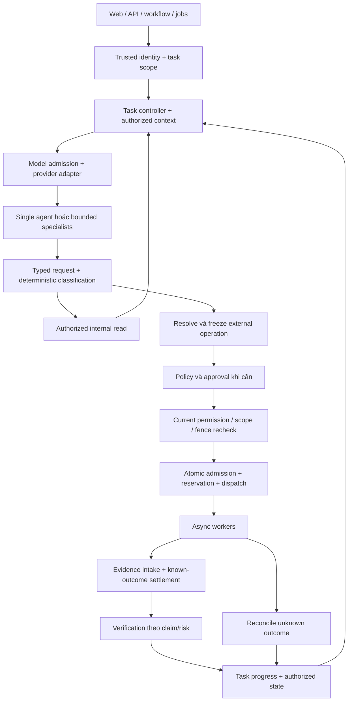

# Định hướng tối ưu RedForge: kế thừa runtime, bổ sung control có chọn lọc

Ngày đánh giá: 07/09/2026. Baseline mã nguồn: branch `translate`, commit `bf87263827e925ccbe0b953169e985b81cd8b3d1`.

Tài liệu này đưa ra quyết định kiến trúc và estimate để lựa chọn hướng phát triển. Đây là kết quả đọc source/docs và phân tích thiết kế; chưa phải kết quả chạy benchmark, load test hay kiểm chứng toàn bộ runtime. Các số effort và ngưỡng nghiệm thu bên dưới là ước lượng hoặc mục tiêu đề xuất, không phải số đo hiện tại.

## 1. Quyết định được khuyến nghị

**Tiếp tục phát triển trên codebase RedForge hiện tại, giữ runtime và trải nghiệm vận hành của CyberStrikeAI; đưa các invariant có giá trị từ Governed Security Analysis vào những điểm quyết định quyền, trạng thái, evidence và retry.**

Ưu tiên triển khai theo từng lát chức năng có thể đo và rollback. Chưa có bằng chứng cho thấy viết lại hệ thống theo toàn bộ `workspace.dsl` đem lại lợi ích tương xứng với chi phí và nguy cơ giảm hiệu quả black-box.

Ba quyết định cốt lõi:

1. Giữ năng lực reasoning, lựa chọn công cụ, thích nghi với quan sát và nối chuỗi phát hiện. Một task bắt đầu bằng single-agent; chỉ tăng orchestration khi có công việc độc lập hoặc lợi ích đã đo được.
2. Backend sở hữu identity, scope, permission, budget, admission và verified state. Agent có thể tạo hypothesis và đề xuất hành động trong phạm vi capability; quyết định thực thi do code kiểm tra.
3. Chọn control theo hậu quả và độ bất định. Read nội bộ, model call, diagnostic có tác động bên ngoài, và operation cần review có đường xử lý phù hợp; tất cả vẫn giữ đúng boundary của mình.

Hướng này có độ tin cậy **cao về khả năng tận dụng code và giảm rủi ro thay thế runtime**, **trung bình về lợi ích vận hành dự kiến**, và **thấp về mức tăng hiệu quả black-box/token cụ thể** trước khi có baseline.

## 2. Mục tiêu và cách hiểu hai nguồn đầu vào

[comparative.md](comparative.md) là hội thoại nghiên cứu: phần đầu so sánh hai hệ thống, phần sau đề xuất hybrid. [workspace.dsl](workspace.dsl) là kiến trúc Governed nguyên bản; chưa tích hợp đầy đủ fast path, verification tiers, lazy capabilities hoặc recovery giản lược của hybrid.

CyberStrikeAI/RedForge là sản phẩm đã có runtime. Governed Security Analysis là thiết kế về quyền hạn, workflow, trạng thái và bằng chứng. So sánh source đã chạy với invariant trên sơ đồ chỉ cho phép đánh giá mức hoàn thiện và chủ đích thiết kế, chưa cho phép kết luận hệ thống nào hiệu quả hơn sau triển khai.

Mục tiêu tối ưu được dùng trong tài liệu này:

- Bảo toàn khả năng kiểm thử và khai thác black-box trong phạm vi engagement đã được cấp quyền.
- Tăng tỷ lệ kết quả có thể xác minh và giảm mất context, vòng lặp, thực thi trùng, kết luận sớm, trạng thái không xác định.
- Giảm tổng chi phí cho một nhiệm vụ đạt chất lượng yêu cầu, bao gồm token, thời gian tool, thời gian operator và chi phí vận hành.
- Giữ V1 có thể triển khai bằng một backend với các module rõ ràng; chi phí phát triển phải tương xứng với rủi ro thực tế.

DSL hiện giới hạn scope ở analysis, approved diagnostics và bounded recovery, đồng thời loại trừ autonomous exploitation/intrusion. Vì vậy **không nhập nguyên giới hạn chức năng đó vào RedForge** nếu mục tiêu là giữ năng lực black-box hiện có. Định hướng ở đây mượn control semantics của proposal; một bản kiến trúc hybrid sau này phải ghi rõ scope của RedForge. Tài liệu này chưa thay đổi DSL hoặc runtime.

## 3. Căn cứ mã nguồn và các nhận định cần hiệu chỉnh

Các đường dẫn tương đối dưới đây tính từ `.agent`; revision ở đầu tài liệu là mốc để tái kiểm tra. Có code/test file không đồng nghĩa test đã được chạy hoặc mọi entry point đã được bao phủ.

| Căn cứ | Điều xác nhận được | Hệ quả với lựa chọn kiến trúc |
| --- | --- | --- |
| [Architecture](../docs/architecture.md), [go.mod](../go.mod), [app](../internal/app/app.go) | Go/Gin, frontend tĩnh, Eino, SQLite, MCP, nhiều module sản phẩm đã hiện hữu | Giữ nền triển khai và UI; chưa cần rewrite stack |
| [Workflow agent node](../internal/workflow/nodes.go), [multi-agent guide](../docs/MULTI_AGENT_EINO.md) | Node agent mặc định `eino_single`; có các đường orchestration khác | Giữ nhiều mode, chuẩn hóa tiêu chí chọn mode; không suy ra single-agent luôn thắng |
| [Principal](../internal/authctx/principal.go), [MCP authorization](../internal/app/mcp_authorization.go) | Có principal từ server, resource permissions, deny builtin thiếu policy; external MCP đòi permission/global scope | Củng cố policy hiện có; resource RBAC chưa chứng minh target/command scope được kiểm soát đầy đủ |
| [Execution service](../internal/mcp/execution_service.go), [monitor persistence](../internal/database/monitor.go) | Có execution ID, bounded wait, live entries trong memory và trạng thái orphan | Giữ async runtime; bổ sung durable operation/attempt và outcome reconciliation |
| [External MCP manager](../internal/mcp/external_manager.go) | Có per-server/global limits và circuit breaker | Tái sử dụng; không nhận định mọi loại tool/provider đã có cùng mức bảo vệ |
| [Result guard](../internal/mcp/tool_result_guard.go), [execution guide](../docs/tool-execution-governance.md) | Capped output và spill ra file, có preview | Giữ cơ chế; thay coupling vào absolute path bằng artifact identity và authorized reads |
| [Context budget](../internal/multiagent/context_budget.go), [middleware](../internal/multiagent/eino_middleware.go) | Đã có token counting/compaction và lazy tool search | Context Broker là bước nâng cấp về scope/state/freshness, không phải xây context management từ số 0 |
| [Provider adapter](../internal/multiagent/eino_agentic_tool_calling_adapter.go), [model compatibility gate](../internal/multiagent/eino_agentic_model_gate.go) | Có adapter và compatibility checks cho Eino | Chuẩn hóa, kiểm thử các adapter đang có; gate này chưa tương đương budget/admission ledger của proposal |
| [Knowledge base](../docs/knowledge-base.md), [knowledge module](../internal/knowledge/) | Pipeline retrieval đã có | Giữ retrieval on-demand; KB không được trở thành nguồn quyền hoặc trạng thái target |
| [Dry-run](../internal/workflow/dry_run.go), [checkpoint store](../internal/workflow/checkpoint_store.go), [metrics](../internal/workflow/metrics.go) | Có validation/simulation, checkpoint, trace/metrics và replay script | Mở rộng từ nền có sẵn; dry-run không chứng minh target thực hoặc model stochastic sẽ thành công |
| [Project fact tools](../internal/app/project_fact_tools.go) | Agent có thể ghi project fact và confidence qua tool | Giữ blackboard, nhưng cần phân biệt observation/claim với verified finding |
| [Finalizer](../internal/agentfinalizer/decision.go) | Chặn một số trường hợp empty response, pending tools, thiếu completed execution khi được yêu cầu | Không nói hệ thống thiếu finalization gate; gate hiện tại chưa xác minh nội dung claim |
| [SQLite setup](../internal/database/database.go) | WAL, pool giới hạn, nhận thức single-writer; cấu hình `_synchronous=NORMAL` | Đo lock/checkpoint và xác định durability trước khi đổi DB hoặc tuyên bố dispatch bền vững |
| [HITL config](../config.example.yaml), [effective prompt](../internal/config/config.go) | Example mặc định HITL off; prompt effective dùng field chuẩn hoặc built-in | Giữ UX HITL, thiết kế default theo deployment profile; key `legacy_audit_agent_prompt` không thay thế field effective |

Tài liệu upstream cũng mô tả nền [một Go application](https://github.com/AIPentest/CyberStrikeAI/blob/main/docs/en-US/architecture.md), [bounded tool execution](https://github.com/Ed1s0nZ/CyberStrikeAI/blob/main/docs/en-US/tool-execution-governance.md) và [workflow runtime](https://github.com/Ed1s0nZ/CyberStrikeAI/blob/main/docs/en-US/workflow-graph.md). Các trang `main` có thể thay đổi; quyết định triển khai phải quay về checkout đã pin, không giả định RedForge hoàn toàn giống upstream.

Những điều không nên tiếp tục khẳng định như fact:

- Không có cơ sở chấm hybrid “token efficiency cao” hay “khai thác không kém” chỉ bằng số component.
- Nhiều module trong monolith không đồng nghĩa nhiều network hop; số transaction mới cần đo.
- Ledger có một owner logic không mặc nhiên trở thành một actor tuần tự hoặc bottleneck.
- DSL có canonical events và transactional current state; không quy định mọi UI state đều full event-sourced.
- Verifier trong cùng backend có độc lập về ownership, chưa có isolation ở process/credential.
- Local `tools/` có 90 YAML/YML recipes tại mốc đánh giá; số tool recipes không đại diện trực tiếp cho năng lực khai thác.
- `EvidenceVerified=true` của finalizer hiện không có nghĩa từng vulnerability claim đã được xác nhận. Code có thể dựa vào trạng thái execution; tên field dễ khiến downstream diễn giải quá mức.

## 4. So sánh các phương án phát triển

Estimate dưới đây là bậc độ lớn để chọn hướng, không phải báo giá. Một người-tuần là khoảng 5 ngày kỹ thuật tập trung. So sánh chất lượng là suy luận từ phạm vi thay đổi; chưa phải kết quả đo.

| Phương án | Lợi ích kỳ vọng | Hạn chế | Effort sơ bộ | Quyết định |
| --- | --- | --- | --- | --- |
| A. Chỉ tune config/prompt | Có thể giảm context dư, retry và thời gian chờ; rollout nhanh | Không giải quyết đầy đủ authority, durable outcomes và fact semantics | 2–5 người-tuần cho baseline và tuning có giới hạn | Là lát đầu tiên, chưa đủ làm hướng dài hạn |
| B. Nâng cấp dần RedForge theo hybrid | Giữ năng lực sản phẩm; thêm control tại boundary; đo được từng thay đổi | Đòi hỏi kiểm tra nhiều execution entry point, migration và compatibility | 27–46 người-tuần cơ sở; 33–56 khi cộng dự phòng khoảng 20% | **Khuyến nghị** |
| C. Xây lại theo toàn bộ DSL | Ownership rõ từ đầu, có thể chủ động mô hình dữ liệu | Phải tái tạo runtime/product parity; recovery phức tạp; scope DSL không trùng black-box | 60–120+ người-tuần, độ tin cậy thấp; có thể tăng nếu tái tạo đầy đủ sản phẩm | Chưa có căn cứ chọn |

B thắng ở khả năng giao giá trị từng bước và giữ đường kiểm chứng. A có thể đủ nếu benchmark chỉ ra mọi vấn đề chính là cấu hình. C chỉ nên xem lại khi một spike cụ thể chứng minh boundary hiện tại không thể cải tạo với chi phí chấp nhận được, hoặc yêu cầu isolation/multi-tenancy làm thay đổi nền triển khai.

## 5. Những gì nên giữ từ CyberStrikeAI

| Thành phần | Quyết định | Điều cần điều chỉnh | Mức ưu tiên |
| --- | --- | --- | --- |
| Go/Gin, UI hiện tại, streaming progress, API, project/asset/vulnerability workflows | Giữ | Refactor wiring tại nơi cần; giữ compatibility contracts | Nền bắt buộc |
| Single-agent, Deep, Plan-Execute, Supervisor và specialist definitions | Giữ năng lực | Single-first theo workload; một owner decomposition cho mỗi work item; không nested delegation vô hạn | P1 |
| Tool/MCP/YAML/skill ecosystem | Giữ | Capability metadata và chung admission contract; không tăng tool count để thay cho cải tiến kiến trúc | P2 |
| Tính thích nghi của agent | Giữ mạnh | Cho phép khám phá hypothesis, request context/capability và đề xuất kế hoạch mới; backend kiểm tra authority | Xuyên suốt |
| Async execution và execution ID | Giữ mạnh | Scheduler nhận completion để tránh vòng LLM polling chỉ để chờ; thêm operation/attempt identity | P1–P2 |
| Hard timeout, cancellation, output cap, preview, backpressure, external MCP breaker | Giữ mạnh | Phân biệt wait timeout/hard timeout/unknown effect; audit coverage theo execution path | P1–P2 |
| Tool search/lazy exposure và context compaction | Giữ | Giảm always-visible set theo task, bảo toàn protocol tool-call/result và evidence references | P1 |
| KB/RAG, fact index, model-facing trace và checkpoint | Giữ | Kiểm soát relevance/freshness/ACL, trạng thái verification; resume đọc canonical state hiện tại | P1–P3 |
| RBAC, authentication, resource ownership | Giữ và mở rộng | Bổ sung target/effect scope và delegation; không tạo một policy engine song song mâu thuẫn | P2 |
| HITL approve/reject/edit và audit UX | Giữ | Review theo policy; edited args làm mất hiệu lực approval cũ khi material change; audit agent là tư vấn | P2 |
| Workflow graph, validation, dry-run, replay, metrics | Giữ | Thêm fault fixtures, common IDs và benchmark thật; graph/agent không cùng sở hữu một decomposition | P0–P3 |
| Finalization gate | Giữ, nâng semantics | Tách execution settled, evidence recorded, claim verified, task done | P3 |
| Provider adapters, error/stream/retry handling | Giữ | Một compatibility contract và test suite; pin model/provider config cho từng call | P1 |
| C2/WebShell/robot/integrations | Giữ khả năng tương thích | Chỉ expose/init theo profile cần dùng; mọi side-effect path áp dụng cùng contract trước khi công bố được quản trị đầy đủ | P2 và theo workload |
| SQLite hiện tại | Giữ cho pilot một backend | Đo contention/durability; chưa ép KB DB nhập vào operational DB | P0–P3 |

Không có căn cứ loại bỏ multi-agent, checkpoint hoặc provider layer chỉ vì proposal mô tả đường đi rõ hơn. Lợi ích của hybrid đến từ boundary và state semantics, không từ việc thay toàn bộ framework.

## 6. Những gì nên tiếp nhận từ proposal

| Ý tưởng trong DSL | Mức áp dụng vào RedForge | Cách triển khai thực dụng | Chi phí/rủi ro chính |
| --- | --- | --- | --- |
| Server-owned identity/delegation | Áp dụng invariant đầy đủ | Mở rộng principal/request envelope, kiểm tra tại entry và lúc dùng quyền | Bỏ sót job/robot/MCP entry point |
| Policy quyết định, transition owner mutate state | Áp dụng ownership | Tách interfaces trong Go; không cần mỗi component là một service | Hai lớp policy cho kết quả khác nhau nếu migration thiếu chặt chẽ |
| LLM chỉ proposal | Áp dụng ở authority boundary | Tool call trở thành request có typed contract; LLM không commit permission/fact/budget | Wrapper không đủ nếu còn đường gọi executor trực tiếp |
| Scope/Budget Ledger | Áp dụng reserve/settle idempotent | Dùng shared transaction cho admission, reservation, attempt; token/cost dùng observed usage hoặc unknown hold | Ghi DB, concurrency, provider usage thiếu |
| Context Broker | Áp dụng từng phần từ sớm | Bọc context builder hiện có bằng authorized task snapshot, retrieval API, revision/freshness checks | Cắt context quá mạnh làm mất chain/hypothesis |
| LLM Call Gate | Áp dụng mọi model call | Bao gồm planner, summarizer, audit agent, verifier hỗ trợ LLM, report, retry/failover | Call site ẩn khiến budget không đầy đủ |
| Frozen operation và operation/attempt IDs | Áp dụng cho external execution | Pin adapter/version, target, params, relevant config, inputs và policy revision; mỗi retry có attempt mới | Canonicalization và migration history |
| Exact approval binding | Áp dụng khi policy yêu cầu approval | Bind frozen contract; final recheck trước dispatch; approval không tự mở rộng scope | Approval fatigue nếu phân loại risk quá rộng |
| Atomic Dispatch | Áp dụng cho external work cần recovery | Transaction commit operation/attempt/reservation/outbox trước worker claim | Commit DB không bảo đảm exactly-once external effect |
| Evidence → Verification → Fact | Áp dụng semantics, chia tier | Raw evidence bất biến; claim/observation vẫn dùng được khi chưa verified; verifier service sở hữu verdict | Domain verification coverage, backlog |
| Deterministic Progress Reducer | Áp dụng với task contract | Completion dựa acceptance criteria, valid evidence và pending work | Không thể viết một rule đơn giản cho mọi mục tiêu mở |
| Outcome Reconciliation | Áp dụng theo uncertainty | Known result settle trực tiếp; ambiguous effect/usage/delivery đi reconciler | Mỗi adapter cần outcome/retry semantics |
| PHASE/MISSION STOP và fencing | Áp dụng core V1 | Scope/epoch, stale admission checks, explicit resume, owner cho unresolved effects | Race giữa STOP, claim, dispatch và late result |
| Canonical/derived state tách biệt | Áp dụng ngay trong schema/interfaces | Audit sự kiện quan trọng và current-state tables; KG/search/telemetry không cấp authority | Projection stale, dual-write mất đồng bộ |
| Reporting/export integrity | Áp dụng theo loại output | Finding provenance từ đầu; exact artifact freeze/release cho report cần kiểm soát | Biến mọi chat message thành export workflow sẽ quá nặng |
| Recovery handover và compensation đầy đủ | Tham khảo, hoãn phần phức tạp | V1 dùng một owner xác định, bounded reconciliation, registered cleanup | Explosion số trạng thái nếu làm mọi overlap ngay |

## 7. Thiết kế vận hành hybrid đề xuất

### 7.1. Ba đường xử lý và boundary chung



Sơ đồ thể hiện luồng chính, không thay thế contract chi tiết. Direct tool nodes không cần model call nhưng vẫn qua cùng classification/admission. Mọi lần gọi model, kể cả để kiểm tra evidence hoặc viết report, đều dùng LLM admission.

| Loại việc | Đường tối thiểu | Điều tuyệt đối không suy diễn |
| --- | --- | --- |
| A: đọc dữ liệu nội bộ đã lưu, không external effect | Authenticated read → ACL/scope/freshness → bounded result | “Read” không cho quyền đọc secret hoặc dữ liệu tenant khác; không bỏ authorization vì tool name nằm trong allowlist |
| B: diagnostic có giới hạn, policy cho phép tự chạy | Resolve/freeze → current policy/fence/budget → atomic dispatch → async runner | HTTP GET/scanning vẫn có external effect, rate và target scope; không tự xếp vào A |
| C: operation mà policy yêu cầu review hoặc có hậu quả đáng kể | B + approval bind exact contract, final recheck sau thời gian chờ | Không cho LLM tự giảm risk class hoặc coi thông tin thiếu là approval |

Classifier do code và capability metadata sở hữu. Unknown effect metadata không đi vào cheap path bằng suy đoán. Đây là sửa đổi cần thiết so với mô tả `Class A: Policy → Dispatch` trong comparative: internal read không cần external dispatch, còn external action không được mất gate vì gọi là read-only.

### 7.2. Orchestration và exploration

Một work item có một decomposition owner: agent controller hoặc workflow graph. Specialist có thể phân tích và đề xuất subtask; việc nhận thêm subtask/depth phải do owner cấp trong budget, không tạo cây agent không giới hạn.

Giữ hypothesis chưa verified trong task state với evidence refs và trạng thái rõ. Agent được dùng chúng để đề xuất bước thu thập thông tin tiếp theo; policy quyết định bước đó có được phép hay không. Nếu buộc mọi hypothesis phải thành verified fact trước khi được khám phá tiếp, hệ thống có thể giảm mạnh khả năng black-box.

Resolver không nên biến thành planner bằng hàng nghìn nhánh if/else. Registry lọc một tập capability phù hợp scope/schema/effect; agent có thể đề xuất lựa chọn và args trong tập đó; resolver kiểm tra rồi freeze operation cụ thể. Không tìm thấy capability thì trả typed outcome, cho phép owner đề xuất một hướng khác trong quyền hiện có.

Tool visibility là tối ưu context, không phải cơ chế authorization. Dynamic tool discovery không được grant quyền; tool đã ẩn vẫn phải bị gate kiểm soát nếu có request trực tiếp.

### 7.3. State, context và provider

Task snapshot nên có: goal/scope, task revision, hypothesis và negative results, verified findings, evidence references, pending executions, unknown outcomes, dependency state, remaining budget và stop epoch. Transcript tiếp tục phục vụ giao tiếp/audit; current task state phải khôi phục được mà không yêu cầu model đoán lại lịch sử.

Context được cấp theo principal/task/authz revision. Cache reuse phải kiểm tra quyền hiện tại; TTL đơn thuần không xử lý revocation. Giữ retrieval theo nhu cầu và raw evidence qua artifact refs; không nhét toàn KB/KG hoặc toàn history vào mỗi call.

Bảo toàn tool-call/result pairing, provider-native fields cần thiết và khả năng resume trong adapter hiện tại. Thêm typed errors phân biệt protocol, rate limit, context overflow, cancellation và ambiguous delivery; không retry cùng một malformed stream nhiều lần mà thiếu thay đổi có căn cứ. Compatibility tests là đầu tư tốt hơn thay framework chỉ vì một issue upstream từng tồn tại.

Budget model call tính cả retries, failover, summarization, verification và report. `max_iterations` chỉ là một guard; cần thêm token/cost/deadline/no-progress. Chọn model rẻ hơn chỉ sau khi cùng workload giữ chất lượng; giảm giá mỗi call có thể tăng tổng giá khi retry nhiều.

### 7.4. Execution, durability và unknown outcomes

Logical `operation_id` tồn tại qua retries; mỗi lần thực thi có `attempt_id`. Digest là nhận dạng nội dung contract, không thay thế identity. Material change tạo contract revision/new operation theo domain rule, vô hiệu approval cũ; không âm thầm đổi params dưới grant cũ.

Admission transaction kiểm tra current scope/fence, claim grant, reserve quota và ghi dispatch/outbox. Worker chỉ claim committed work. Final check và claim cần phối hợp nguyên tử hoặc điều kiện revision để tránh khoảng hở giữa check và commit.

DB commit và external effect không thuộc một distributed transaction. Vì vậy không tuyên bố exactly-once effect. Một crash sau khi request rời worker nhưng trước khi ghi result có thể tạo `UNKNOWN`; retry chỉ khi contract/idempotency hoặc bounded reconciliation chứng minh hợp lệ.

Reconciliation dùng cho external effects, model usage/reservations, orphan work và export delivery chưa xác định. Known success/failure đi thẳng settlement. Wait timeout chỉ nói thời gian chờ hết; hard timeout/cancel không chứng minh effect chưa xảy ra. Late results vẫn được nhận với attempt/version checks và idempotent settlement.

Scope của durability phải ghi rõ: process crash, OS crash hay mất điện/storage failure. Cấu hình SQLite hiện tại chưa tự chứng minh các guarantee durable dispatch của proposal. Pilot phải chọn durability policy, đo latency và fault-test tương ứng; storage recovery không được bỏ sót artifact bytes đã tham chiếu.

### 7.5. Verification và completion

| Tier | Dữ liệu/claim | Cách xử lý | Được dùng làm gì |
| --- | --- | --- | --- |
| V0 | Debug, intermediate observation, hypothesis | Ghi provenance tối thiểu, không semantic verification | Hỗ trợ reasoning; không xuất bản verified finding |
| V1 | Schema, hash, parser result, metadata consistency | Kiểm tra deterministic trong process | Xác nhận cấu trúc/integrity; hash không chứng minh nội dung claim là đúng |
| V2 | Claim ảnh hưởng finding hoặc acceptance criteria | Domain verifier đối chiếu evidence, thời điểm và rule version | Xuất verdict verified/invalidated/inconclusive theo contract |
| V3 | Claim có hậu quả lớn, access/impact/cleanup quan trọng | Nguồn chứng cứ xác nhận độc lập hoặc người review theo contract | Mức assurance cao hơn; mọi diagnostic bổ sung vẫn đi execution gate |

Tier do claim contract/policy quyết định. V2 không bắt buộc một LLM mới; V3 không đồng nghĩa để hai LLM biểu quyết. Verifier là owner của verdict; có thể chạy synchronous deterministic khi rẻ và asynchronous khi cần. Việc chia tier không được cho V0/V1 tự nâng thành semantic fact.

Finalizer hiện tại là nền để nâng cấp. Tách rõ `execution_settled`, `evidence_present`, `claim_verified`, `task_completed`; giữ tương thích API bằng versioning thay vì âm thầm đổi nghĩa field. Migration fact cũ sang observation/legacy-unverified nếu thiếu chứng cứ; không tự xác nhận toàn bộ history.

Task contract ghi trước điều kiện done, blocked, partial và no-progress. Tác vụ mở không có proof of completeness phải được kết thúc với giới hạn coverage/unknowns rõ, thay vì coi hết budget là “đã kiểm thử đầy đủ”.

### 7.6. STOP, persistence và report

V1 giữ PHASE/MISSION STOP, fence epoch, cancellation, explicit resume và một owner cho mỗi unresolved effect. Mission STOP ưu tiên admission toàn mission. Để giảm handover complexity, V1 có thể freeze admission của phase recovery, giữ nguyên ownership dữ liệu, cho mission controller điều phối reconciliation tuần tự trước cleanup. Không để hai episode đồng thời claim cùng compensation; không cho resume nếu recovery contract chưa cho phép.

Hoãn sophisticated effect migration/handover, nhưng không hoãn xử lý race STOP/dispatch, late result và stale claim. STOP chặn công việc mới; không thể thu hồi request đã đến remote system.

Giữ một backend và operational ACID database cho pilot; KB database hiện có có thể tiếp tục riêng. Một transaction boundary cho approval/ledger/dispatch quan trọng hơn đếm số DB file. Dùng current-state tables cùng append-only audit events cần thiết; heartbeat/UI transient state không buộc replay toàn lịch sử. KG/search/projection phải rebuild được và không sở hữu unique authoritative facts.

Giữ local artifact storage qua interface với artifact ID, hash, authorized range read, retention và backup. Chưa bắt buộc object storage hoặc graph DB. Report cần kiểm soát có template/version, evidence provenance, redaction, frozen digest và destination-bound release; conversational update thông thường không đi toàn bộ export approval chain.

## 8. Những gì nên hoãn hoặc không chọn làm mặc định

| Nội dung | Quyết định hiện tại | Điều kiện xem lại |
| --- | --- | --- |
| Rewrite Eino/provider/streaming runtime | Hoãn | Compatibility spike chứng minh lỗi nền không sửa được hợp lý |
| Multi-agent cho mọi task, nested planning tùy ý | Không làm mặc định | A/B cho thấy decomposition cụ thể cải thiện quality/cost |
| Toàn bộ Mission → Phase → Scheduler cho câu hỏi nhỏ | Rút gọn object/transaction path | Chỉ thêm phase khi có dependency/lifecycle cần quản lý |
| Human approval cho mọi action | Không chọn | Policy theo effect/target/args; approval bắt buộc giữ nguyên |
| AI audit có quyền override hard boundary | Không chọn | Không dùng confidence để thay permission |
| Verify độc lập mọi observation | Không chọn | Dùng tier theo claim và hậu quả |
| LLM polling tool chỉ để đợi | Tránh | Giữ polling UI/runtime có backoff; đánh thức agent khi có thông tin mới |
| Full event sourcing, Kafka/Redis/graph DB/microservices ngay V1 | Hoãn | Đo được bottleneck hoặc cần isolation/deployment độc lập |
| Mọi combination recovery takeover/compensation | Hoãn | Use case/fault telemetry chứng minh core recovery không đủ |
| Đổi sang PostgreSQL chỉ vì SQLite có single writer | Hoãn | Contention/latency hoặc multi-instance requirement vượt SLO sau tối ưu transaction |
| Xem KB, KG, transcript, agent confidence là authoritative | Không chọn | Authority/facts phải qua owner và contract thích hợp |

Runner isolation nên giữ seam từ đầu và ưu tiên theo workload triển khai. Một modular monolith vẫn có thể dùng subprocess/worker với quyền giới hạn; nếu pilot cần chạy nhiều tenant hoặc tools có đặc quyền lớn, isolation trở thành yêu cầu sớm và effort dưới đây phải cập nhật.

## 9. Estimate khách quan về lợi ích và chi phí

### 9.1. Lợi ích kỳ vọng theo workload

| Workload | Điều có khả năng cải thiện | Điều có thể tệ hơn | Độ tin cậy hiện tại |
| --- | --- | --- | --- |
| Câu hỏi ngắn, ít tool | Single-first và giảm tool/context dư có thể giảm model overhead | Extra gates/DB writes có thể tăng latency | Trung bình về trade-off; chưa biết độ lớn |
| Mission dài, nhiều facts | Task state, evidence refs, negative results có thể giảm rediscovery và mất chain | Retrieval/compaction sai bỏ mất thông tin cần thiết | Trung bình |
| Nhiều tool chạy lâu | Async completion và backpressure giảm LLM polling, ổn định tài nguyên | Queue limits quá thấp tăng wall time | Cao về cơ chế, chưa đo throughput |
| Crash/lost ACK/timeout | Durable identity và reconciliation giảm blind retry, tăng khả năng giải thích trạng thái | Uncertainty làm chậm tiếp tục khi thiếu adapter semantics | Cao về mục đích control, chưa chứng minh coverage |
| Black-box có nhiều nhánh khám phá | Adaptive agents và shared state có thể tận dụng kết quả tốt hơn | Capability filtering, verification hoặc HITL quá rộng chặn exploration hữu ích | Thấp về net success rate |
| Nhiều mission/tenant đồng thời | Admission/budget giúp tránh oversubscription | SQLite contention, verifier queue và isolation có thể chi phối | Thấp trước load test |

Không cộng “% tiết kiệm context”, “% giảm retry” và “% ít agent” thành tổng vì chúng chồng lấn. Đơn vị tối ưu là một mission đạt chất lượng, không phải một model call.

Mô hình đo:

```text
Mission cost = model usage của mọi call/retry
             + tool/compute cost + storage/retrieval cost
             + operator time (báo riêng nếu chưa quy đổi tiền)

Cost per successful mission = tổng cost tất cả runs / số runs đạt rubric
Latency = critical path của reasoning, queue, tool, verification và human wait
Budget available = limit - consumed - reserved
```

Ví dụ minh họa, KHÔNG phải estimate RedForge: baseline 100 runs tiêu tốn 100 đơn vị và 80 runs thành công, cost/success = 1,25. Candidate tiêu tốn 80 nhưng chỉ 60 runs thành công, cost/success ≈ 1,33. Giảm 20% tổng cost trong ví dụ vẫn là kết quả tệ hơn về chi phí trên một success.

### 9.2. Effort theo work package

Giả định: đội quen Go/Eino, sử dụng code/UI/toolset hiện có, pilot một backend, có môi trường benchmark hợp lệ, thay đổi schema kiểu additive và chỉ xây verifier/adapter semantics cho workload pilot đã chọn. Ước lượng bao gồm code, tests trong package và docs; integration cross-path được tính riêng. Chưa có staffing thực tế nên không coi đây là deadline cam kết.

| Gói | Nội dung và deliverable | Người-tuần |
| --- | --- | ---: |
| W0 | Baseline, entry-point inventory, trace correlation, rubric và fixtures ban đầu | 2–3 |
| W1 | Context snapshot/Broker tối thiểu, lazy exposure tuning, single-first và giảm polling | 3–5 |
| W2 | Provider contract/error taxonomy và regression fixtures | 2–4 |
| W3 | Capability/identity/scope contracts, deterministic policy integration, approval binding | 4–7 |
| W4 | Operation/attempt, budget reserve/settle, atomic dispatch và durable job recovery | 4–7 |
| W5 | Evidence/fact migration, verification tiers cho pilot, finalizer/progress semantics | 3–5 |
| W6 | PHASE/MISSION STOP core, uncertain-outcome reconciliation, bounded cleanup ownership | 3–5 |
| W7 | Artifact abstraction, report provenance/freeze/release và UI state cần thiết | 2–4 |
| W8 | Integration toàn entry point trong pilot, fault/load/non-regression eval, rollout/rollback | 4–6 |
| **Tổng cơ sở** | **W0–W8** | **27–46** |
| **Có dự phòng khoảng 20%, làm tròn lên** | **Dành cho coupling, migration và lỗi protocol chưa thấy** | **33–56** |

Với 2 kỹ sư làm chính và QA/domain reviewer hỗ trợ, dự kiến khoảng **18–32 tuần lịch**, có xét dependency và phối hợp; không lấy người-tuần chia hai như một lịch chắc chắn. Với một người làm toàn bộ, nên dùng 33–56 tuần tập trung làm điểm xuất phát, cộng thời gian gián đoạn thực tế. Độ tin cậy estimate: trung bình-thấp trước W0 và spike W3/W4.

Lát đầu W0+W1+W2: **7–12 người-tuần cơ sở**, khoảng **5–8 tuần lịch với hai người** nếu có fixtures và quyền truy cập model; đây là incremental release phục vụ đo hiệu quả, chưa đạt đầy đủ governance/recovery hybrid.

Không bao gồm: rewrite frontend, thêm hàng loạt tools/skills, verifier tổng quát cho mọi loại lỗ hổng, migration multi-instance, sandbox platform hoàn chỉnh, advanced recovery handover, formal verification hoặc chi phí chạy benchmark/provider. Nếu các mục này trở thành bắt buộc, phải estimate lại; không giấu chúng trong dự phòng 20%.

Các yếu tố làm estimate tăng: side-effect entry points chưa hội tụ, dữ liệu cũ thiếu provenance, provider usage không đầy đủ, capability scripts không mô tả được effect, approval UI coupling sâu, yêu cầu nhiều tenant, hoặc benchmark thiếu ground truth. W0 phải tạo số liệu để thu hẹp khoảng ước lượng.

## 10. Kế hoạch thực hiện và điều kiện chuyển giai đoạn

| Giai đoạn | Work packages | Điều kiện nghiệm thu |
| --- | --- | --- |
| P0: Đo baseline | W0 | Pin commit/config/model/tool versions; có rubric, trace và thống kê per-workload; không log secrets để đo token |
| P1: Tối ưu runtime/context | W1–W2 | Ablation chỉ ra lợi ích hoặc giữ quality; protocol/compaction không mất evidence refs; chưa tự nhận đạt proposal |
| P2: Củng cố authority/execution | W3–W4 | Các entry point trong pilot hội tụ admission; altered approval, stale scope/fence, duplicate claims và budget races có tests |
| P3: Evidence/recovery/report | W5–W7 | Fact cũ được phân loại, unknown outcome hiện rõ, completion có contract, stop/release không dùng claim cũ |
| P4: Pilot và quyết định rollout | W8 | Quality gate, fault tests, migration/backup/rollback và SLO đạt trên phạm vi đã khai báo |

W2 có thể thực hiện cùng W1; W3 cần inventory W0; W4 cần identity/contracts W3; W5/W6 phụ thuộc durable IDs và state; W7 phụ thuộc artifact/evidence contracts. Verification và scope contracts nên thiết kế sớm dù rollout sau.

Giữ API và field cũ qua compatibility layer. Dùng schema additive/versioned, feature flag theo run/project và canary theo cohort. Một run đã khởi động phải pin contract version, không đổi control mode giữa attempt đang chạy.

Shadow mode chỉ tính và ghi thêm policy/verifier decisions, không tạo lần execution thứ hai. Khi rollback, dừng admission mới, drain/reconcile work đang chạy và giữ lịch sử operation/evidence; không reset budget hoặc phát lại pending side effects để “quay về baseline”. Không gỡ control đã bắt buộc bởi policy để làm benchmark đẹp hơn.

Inventory bắt buộc bao gồm: single/multi-agent, graph tool node, graph agent node, internal/external MCP, Eino filesystem/execute, scheduler/batch/robot, terminal, WebShell/C2 và report release. Đường chưa hỗ trợ phải được khai báo trạng thái rõ; không công bố governance coverage toàn sản phẩm chỉ từ test MCP happy path.

## 11. Cách chứng minh black-box không suy giảm và tối ưu có ích

### 11.1. Thiết kế đánh giá

So sánh candidate với RedForge baseline đã pin. Nếu tuyên bố trực tiếp “không kém CyberStrikeAI upstream”, cần thêm một upstream baseline pin commit và cùng protocol; local RedForge không mặc nhiên đại diện mọi upstream version.

Dùng cùng target snapshots/reset procedure, scope, permissions, tool versions, model/provider configuration, budget và time limit. Không cung cấp code/ground truth target cho agent ở nhóm black-box. Ground truth và rubric chỉ dành cho người chấm/evaluator; tách tập tuning khỏi held-out evaluation.

Corpus cần có tác vụ ngắn, reconnaissance nhiều dịch vụ, multi-step findings, authentication/session state, kết quả âm/decoy, tác vụ dài và provider/tool failures. Fault injection là một suite riêng; không thay thế success benchmark trên target thực. Kết quả phải phân tầng workload để trung bình tổng không che mất regression ở chain tasks.

Khởi đầu bằng pilot 30–50 tình huống đa dạng, ít nhất 3 repeats mỗi cấu hình để ước lượng biến thiên. Đây là kích thước phục vụ học baseline, **không mặc định đủ để chứng minh non-inferiority**. Sau pilot, tính sample size theo success rate, variance, margin và power cần thiết; resampling/CI phải cluster theo scenario, không coi repeated runs cùng target là độc lập hoàn toàn.

Chấm claim bằng rubric/evidence, review mù tên baseline/candidate khi khả thi. Negative findings phải có coverage hợp lý. Blocked/timeout do candidate gây ra được tính vào outcome, không loại khỏi mẫu để tăng success rate. Ghi rõ quy tắc xử lý lỗi hạ tầng chung trước khi chạy.

### 11.2. Metrics và acceptance gates đề xuất

| Nhóm | Cần đo | Gate đề xuất, chưa được nghiệm thu |
| --- | --- | --- |
| Effectiveness | Mission success, valid findings, chain completion, false positives, coverage | Success không suy giảm theo non-inferiority test; không che regression của nhóm critical |
| Chi phí | Input/output/cache tokens, mọi model calls, retries, tool compute, cost/success | Sau quality gate, nhắm giảm ít nhất 10% cost/success ở nhóm mission dài; đây là mục tiêu, không dự báo |
| Thời gian | Time-to-first-valid-finding, total time, p50/p95, human wait tách riêng | Pilot nhắm p95 task ngắn tăng không quá 10%; long-task latency phải báo cùng success |
| Orchestration/context | Handoffs, repeated tool calls, retrieval tokens, context rebuilds, LLM polling calls | Ablation xác định thay đổi nào có lợi; không cắt handoff/context bằng mọi giá |
| State/recovery | Duplicate effects, unknown holds, settlement lag, orphan/restart outcomes | Không observed invariant violation trong suite đã định nghĩa; báo rõ coverage, không suy ra xác suất lỗi bằng 0 |
| Governance | Out-of-scope attempts blocked, stale grant/epoch, altered args, approval waits | Unauthorized dispatch hoặc stale-claim commit là lỗi chặn rollout trên phạm vi áp dụng |
| Storage/runtime | Transactions/operation, lock wait, busy errors, WAL size, queue/verification lag | Định SLO sau baseline và trước load test; không tự suy ra cần đổi database |

Ví dụ non-inferiority cho pilot: đặt `Δ = success_candidate - success_baseline`; chỉ kết luận không suy giảm quá margin nếu lower bound của one-sided 95% CI lớn hơn `-3 điểm phần trăm`. Margin 3 điểm phần trăm là ngưỡng đề xuất cần chốt trước evaluation, không có nghĩa “bằng hoặc tốt hơn tuyệt đối”. Nếu yêu cầu nghiêm ngặt là không kém chút nào, dùng margin 0 và chấp nhận có thể cần nhiều mẫu hơn hoặc không đủ bằng chứng. CI quá rộng có nghĩa **chưa kết luận**, không phải pass.

### 11.3. Fault cases cần chứng minh trước khi nhận guarantee của proposal

1. Crash trước dispatch commit: không external execution. Crash sau commit trước worker claim: work có thể khôi phục với đúng identity và fence.
2. Crash sau external effect trước result ACK: giữ unknown; không blind retry; không đánh dấu completed chỉ vì có record.
3. Hai worker claim hoặc hai retry đồng thời: identity/grant/quota không double-consume; late result không overwrite verdict mới.
4. Permission/scope/approval thay đổi trong thời gian chờ: dispatch recheck nhận ra; edited params không dùng approval cũ.
5. PHASE rồi MISSION STOP trong khi worker/recovery đang chạy: stale admission bị chặn, mỗi effect một owner, resume không mở nhầm phase.
6. Context cache sau revocation, stale fact, conflicting evidence: không tái dùng quyền cũ, không ép inconclusive thành verified.
7. Provider stream interleaved/malformed, empty response, context overflow, usage mất ACK: giữ đúng protocol và budget uncertainty, không mất tool/evidence identity.
8. Artifact bytes chưa durable, projection hỏng, export ACK mất: report không dùng bytes chưa freeze; projection rebuild được; release không tự lặp mù.
9. Backup/restore hoặc nâng version khi có pending work: giữ operation IDs, reservations và unknown states; không replay side effect từ checkpoint như một task mới.

Mỗi suite phải chỉ ra entry point và invariant được cover. Dry-run không chứng minh external side effects; unit test finalizer không chứng minh chất lượng lỗ hổng; load test SQLite không chứng minh policy đúng.

## 12. Các quyết định đã đủ căn cứ và những điều phải để mở

Đủ căn cứ để chọn: giữ codebase/runtime/UI; single-first nhưng giữ multi-agent; giữ async/output caps/lazy tools/RAG/RBAC/HITL/workflow/provider adapters; thêm task state/Broker, authority contracts, operation/attempt, ledger, evidence semantics, scoped STOP và reconciliation theo lộ trình có benchmark.

Đủ căn cứ để hoãn: full rewrite, full recovery handover, mandatory multi-agent, verify mọi observation, DB/service expansion khi chưa đo. Không nhập giới hạn “analysis-only” của DSL vào mục tiêu giữ black-box capabilities.

Chưa đủ căn cứ để khẳng định: hybrid khai thác tốt hơn hoặc bằng baseline, tiết kiệm token bao nhiêu phần trăm, SQLite đã là bottleneck chính, cần bao nhiêu specialist, hay lịch giao hàng chính xác. Các lựa chọn này phải được cập nhật bằng W0, ablation và pilot acceptance gates.

Đề xuất đầu tư cụ thể là **W0 → W1/W2 trước**, tiếp theo **W3/W4**, rồi **W5/W6/W7 và integration W8**. Tiêu chí giữ một thay đổi là nó cải thiện chất lượng, chi phí hoặc invariant cần thiết trên workload đã khai báo với trade-off chấp nhận được. Số lượng component hoặc độ nghiêm ngặt của sơ đồ không được dùng làm thước đo thay thế.
