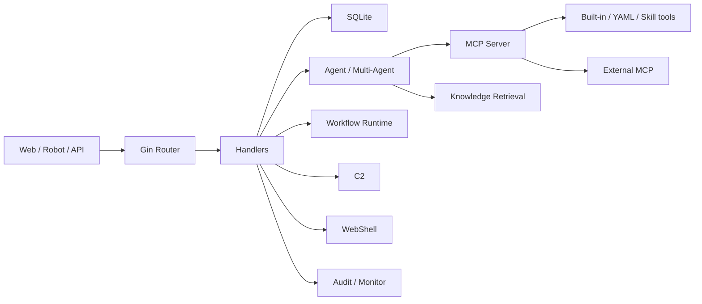

# Architecture

CyberStrikeAI is a single Go Web application with a static frontend, SQLite persistence, Agent orchestration, MCP tooling, workflow graphs, knowledge retrieval, and optional C2/WebShell subsystems.

## Overview

## Web Layer

The entry point is `cmd/server/`, and application assembly is in `internal/app/`. The Web layer uses Gin:

- `web/templates/index.html`: main page.
- `web/templates/api-docs.html`: API documentation page.
- `web/static/js/`: frontend business-module logic.
- `web/static/css/`: styles.

Routes are registered centrally in `internal/app/app.go`.

## Handler Layer

`internal/handler/` is split by business area:

- `agent.go`, `eino_single_agent.go`, `multi_agent.go`.
- `workflow.go`, `workflow_run.go`.
- `knowledge.go`.
- `webshell.go`.
- `c2.go`.
- `audit.go`.
- `monitor.go`.
- `project.go`.
- `vulnerability.go`.
- `config.go`.
- `openapi.go`.

Handlers parse parameters, coordinate business operations after permission middleware, and build HTTP responses.

## Agent Layer

Single-agent and multi-agent code primarily lives in:

- `internal/agent/`.
- `internal/multiagent/`.
- `internal/agents/`.
- `agents/`.

Eino ADK provides single-agent, Deep, Plan-Execute, and Supervisor modes. Markdown files define multi-agent sub-agents.

## MCP and Tools

- `internal/mcp/`: server, external MCP, and connection recovery.
- `internal/einomcp/`: Eino-to-MCP tool adaptation.
- `tools/`: YAML command tools.
- `internal/app/*_tools.go`: registration of built-in Go tools.

Tool calls enter monitoring records and may be subject to HITL approval.

## Workflow

The workflow engine is in `internal/workflow/`, with HTTP entry points in `internal/handler/workflow*.go`. It supports `start`, `agent`, `tool`, `condition`, `hitl`, `output`, and `end` nodes.

See [Workflow Guide](workflow-graph.md) for details.

## Knowledge Base

The knowledge base is in `internal/knowledge/` and includes Markdown/text management, chunking, embeddings, a SQLite vector index, multi-query retrieval, reranking, and retrieval logs. When enabled, it exposes retrieval tools to the Agent.

## Data Layer

`internal/database/` encapsulates SQLite access for:

- Conversations, messages, and process details.
- Groups.
- Tool-execution records.
- HITL logs.
- Knowledge-base indexes and retrieval logs.
- WebShell, C2, project, vulnerability, and batch-task data.

Default database files are `data/conversations.db` and `data/knowledge.db`.

## Security and Auditing

`internal/security/` provides authentication, rate limiting, Shell execution, and command-stream processing. `internal/audit/` and `internal/monitor/` provide platform auditing and execution monitoring.

High-risk modules include Terminal, WebShell, C2, external MCP, filesystem tools, and Shell Skills. Use them with roles, HITL, and deployment isolation.

## Request Path

For `/api/eino-agent/stream`:

1. Gin route enters auth middleware.
2. Handler parses message, conversation, role, uploads, and WebShell context.
3. Agent builds model input: history, role prompt, project facts, tools.
4. Eino Runner calls the model.
5. Tool requests go through MCP.
6. HITL may interrupt before execution.
7. Tool results are saved to process details and monitoring.
8. Model continues and produces final text.
9. SSE streams progress and deltas to the browser.
10. Conversation and process details persist to SQLite.

This explains why a failure may live in auth, config, model, MCP, HITL, DB, SSE, or frontend rendering.

## Cross-Cutting Modules

- Project facts are injected into Agent context.
- HITL sits before tool execution.
- Monitor records tool execution and supports cancellation/review.
- Audit records platform management actions.
- Tool search controls what tools the model can currently see.

These are not just pages; they affect many runtime paths.

Changing these modules requires checking all call sites rather than testing only one page.

## Complexity Hotspots

- `internal/app/app.go`: service construction and route wiring.
- `internal/handler/config.go`: hot application of config across model, KB, C2, robot, MCP.
- `internal/multiagent/`: streaming, retry, summarization, middleware, tools.
- `internal/security/`: auth and shell execution boundary.
- `internal/database/`: SQLite schema compatibility.

## Design Trade-Offs

The project uses a single Go service, static frontend, and SQLite to keep deployment simple. The trade-offs:

- multi-instance scale is not automatic;
- runtime files must be backed up carefully;
- high-privilege tools and admin UI live in one process, so deployment isolation matters.

These are deployment boundaries rather than defects; operators must understand them when designing the deployment.
