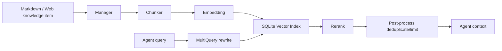

# Knowledge Base


The knowledge base turns local security notes, playbooks, vulnerability guides, and organizational standards into retrievable context for Agents.

## Enable

```yaml
knowledge:
  enabled: true
  base_path: knowledge_base
  embedding:
    provider: openai
    model: text-embedding-v4
database:
  knowledge_db_path: data/knowledge.db
```

When `embedding.base_url/api_key` is empty, the configuration reuses the `openai` settings. Keep the knowledge DB separate when you want portable reusable indexes.

## Content Directory

The default directory is `knowledge_base/`. The project includes examples such as:

```text
knowledge_base/
  SQL Injection/
    README.md
    MySQL Injection.md
  Prompt Injection/
    README.md
```

Use top-level directories for risk types or knowledge domains, for example:

- `SQL Injection`
- `XSS`
- `File Upload`
- `Cloud Security`
- `Incident Response`

## Management Workflow

1. Put Markdown knowledge files under `knowledge_base/`.
2. Scan the directory from the Web knowledge-base page.
3. Rebuild the index.
4. Use search to verify retrieval quality.
5. Tell the role or task that the Agent should query the knowledge base first.

Available API entry points include:

- `GET /api/knowledge/categories`
- `GET /api/knowledge/items`
- `POST /api/knowledge/scan`
- `POST /api/knowledge/index`
- `POST /api/knowledge/search`
- `GET /api/knowledge/index-status`
- `GET /api/knowledge/retrieval-logs`

## Indexing

```yaml
knowledge:
  indexing:
    chunk_size: 512
    chunk_overlap: 50
    max_chunks_per_item: 0
    max_rpm: 0
    rate_limit_delay_ms: 300
    max_retries: 3
    retry_delay_ms: 1000
    chunk_strategy: markdown_then_recursive
    request_timeout_seconds: 120
    prefer_source_file: false
    batch_size: 10
    sub_indexes: []
```

Use `markdown_then_recursive` for clearly structured documents. Lower `batch_size` and increase `rate_limit_delay_ms` when the embedding API has strict limits. Use `max_chunks_per_item` to control the cost of very long documents, and use `sub_indexes` with `sub_index_filter` to isolate business domains.

## Retrieval

```yaml
knowledge:
  retrieval:
    top_k: 5
    similarity_threshold: 0.4
    multi_query:
      max_queries: 4
    post_retrieve:
      prefetch_top_k: 20
      max_context_chars: 0
      max_context_tokens: 0
```

The retrieval chain is approximately: user or Agent query, MultiQuery semantic rewrites, vector retrieval, reranking, post-processing/deduplication, and return to the Agent or API caller. A threshold that is too high misses relevant results; one that is too low adds noise. Start with `0.35` to `0.45`.

## Rerank

```yaml
knowledge:
  retrieval:
    rerank:
      provider: ""
      model: ""
      base_url: ""
      api_key: ""
```

When empty, the provider is inferred from `base_url`. DashScope commonly uses `gte-rerank`; other OpenAI-compatible endpoints may use `/v1/rerank`. If the provider does not support reranking, retrieval quality may decrease; lower `top_k` and improve knowledge-item quality.

## MCP Tools

Enabled KB registers tools such as:

- list risk types;
- search knowledge base;
- retrieve related knowledge chunks.

Prompt roles to query the KB before giving vulnerability validation or remediation advice when unsure.

```text
When vulnerability validation, remediation advice, or detection methods are uncertain, query the knowledge base before giving a conclusion.
```

## Content Writing

Each knowledge item should include:

- Applicable scenarios.
- Detection method.
- Verification steps.
- Common false positives.
- Remediation guidance.
- Tool-command examples.
- Reference links or internal standards.

Avoid combining unrelated topics into one long document. Small, clear documents improve chunking and retrieval.

## Troubleshooting

Indexing failures:

- Check the embedding API key, model name, and `base_url`.
- Lower `batch_size`.
- Increase `request_timeout_seconds`.
- Check service logs for 400/401/429/5xx responses.

Empty retrieval:

- Check whether the index has been rebuilt.
- Lower `similarity_threshold`.
- Check whether `categories` recognized the risk type.
- Do not use an overly narrow `riskType` during search.

Inaccurate retrieval:

- Improve heading hierarchy.
- Split mixed content into multiple documents.
- Add key terms and synonyms.
- Tune `top_k`, `prefetch_top_k`, and rerank settings.

## Internal Data Flow

Knowledge-base retrieval is not full-text search; it is a multi-stage retrieval system:



Retrieval quality therefore depends on source structure, chunk granularity, embedding quality, and rerank availability. Tuning only `top_k` is often not the most effective approach.

## Knowledge-Item Writing Counterexample

Bad:

```text
SQL injection is dangerous. Use sqlmap. Filter input.
```

Better:

```markdown
# MySQL UNION Injection Verification

## Preconditions
- Parameter is concatenated into SELECT.

## Steps
1. Use `order by` to infer column count.
2. Use `union select null,...` to find reflection.
3. Use read-only functions to confirm DB type.

## False Positives
- WAF error page.
- Generic error page.

## Fix
- Parameterized queries.
- Least DB privilege.
```

Structured headings and concrete steps improve chunking and retrieval. The second format gives chunks enough heading, terminology, and step signals for the Agent to execute directly.

## Tuning

Use a fixed test query set, then change one variable at a time:

- empty results: lower `similarity_threshold`, verify indexing;
- wrong topic: improve titles and category/risk type;
- broken context: tune `chunk_size` and `chunk_overlap`;
- noisy results: raise threshold or fix rerank;
- high cost: lower `multi_query.max_queries`, `prefetch_top_k`, or `top_k`.

Use a fixed set of test questions, for example:

```text
How do you determine the column count for a MySQL UNION injection?
How do you verify SSRF access to cloud metadata?
Which false positives commonly occur when bypassing a file-upload blacklist?
```

Then tune one item at a time:

1. Empty search: lower `similarity_threshold` and confirm indexing is complete.
2. Wrong topic: improve document titles and add risk-type filtering.
3. Broken chunks: increase `chunk_overlap` or lower `chunk_size`, then rebuild the index.
4. Too much noise: raise `similarity_threshold` and enable or fix reranking.
5. High cost: lower `multi_query.max_queries`, `prefetch_top_k`, and `top_k`.

Change only one parameter per iteration and record the query results; otherwise it is impossible to identify which variable helped.

## Retrieval Logs

Use logs to improve content:

- frequent no-results queries: missing content or synonyms;
- low scores: titles/terms mismatch;
- duplicate hits: merge or categorize docs;
- Agent ignores results: output may be too long or not actionable.

Retrieval logs are not only for troubleshooting; they can also improve the knowledge base:

- Frequent no-result queries indicate missing knowledge or insufficient synonyms.
- Frequent low-score queries indicate a mismatch between document titles and terminology.
- Multiple duplicate documents for one question indicate a need to merge them or add a category.
- Agents frequently ignoring knowledge-base results indicates that results are too long, too scattered, or lack a clear conclusion.

## Source Anchors

- Manager: `internal/knowledge/manager.go`
- Index pipeline: `internal/knowledge/index_pipeline.go`
- Chunking: `internal/knowledge/chunk_eino.go`
- Retriever: `internal/knowledge/retriever.go`
- Eino chain: `internal/knowledge/eino_retrieve_chain.go`
- Rerank: `internal/knowledge/rerank_http.go`
- MCP tools: `internal/knowledge/tool.go`
