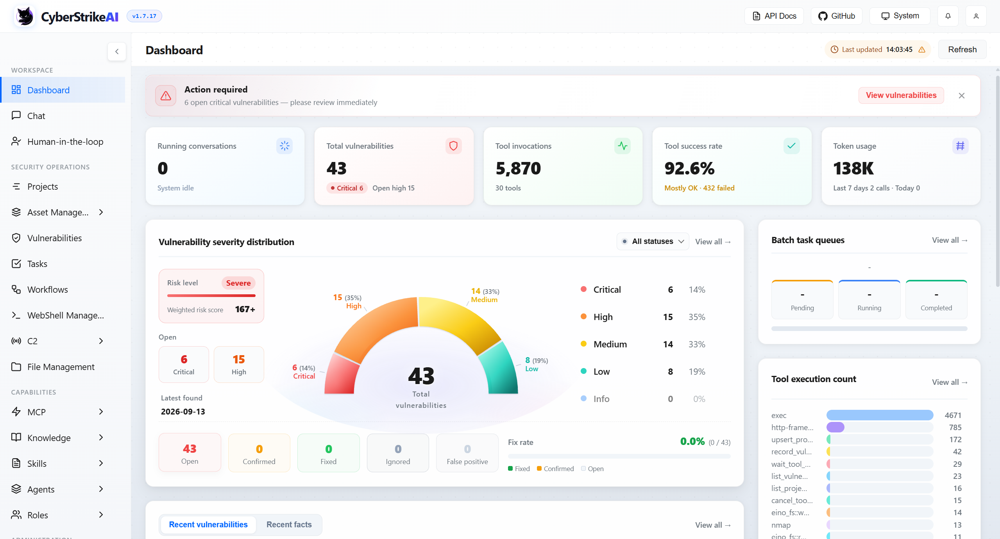

# 1. Tổng quan

## 1.1 CyberStrikeAI là gì?

CyberStrikeAI là **nền tảng pentest tự động hóa AI-native** — kết hợp lập kế hoạch, thực thi, giám sát con người, bằng chứng (evidence), và phân tích trong một workspace có kiểm soát. Hệ thống được xây dựng bằng Go, sử dụng các agent AI để thực hiện các tác vụ bảo mật (reconnaissance, vulnerability analysis, exploitation guidance, reporting).

**Đặc điểm chính:**
- **Agent-based execution**: AI phân tích yêu cầu, lập kế hoạch, gọi công cụ (tools), và tổng hợp kết quả.
- **Human-in-the-loop (HITL)**: Hỗ trợ phê duyệt trước khi thực thi các công cụ nhạy cảm.
- **Evidence-based**: Mọi kết quả được lưu trữ và liên kết (fact board, assets, vulnerabilities).
- **Modular & extensible**: Hỗ trợ MCP (Model Context Protocol), skills, roles, workflows.
- **RBAC**: Quản lý người dùng, vai trò, và phân quyền chi tiết.

---

## 1.2 Các chức năng chính

| Chức năng | Mô tả |
|---|---|
| **Chat / Agent** | Giao tiếp với AI, yêu cầu thực hiện tác vụ (scan, phân tích, tìm kiếm thông tin). |
| **Project & Attack Chain** | Tổ chức engagement theo dự án, liên kết các sự kiện thành chuỗi tấn công. |
| **Asset Management** | Quản lý tài sản (host, domain, IP, service), import/export, tìm kiếm qua FOFA/ZoomEye/Shodan. |
| **Vulnerability Management** | Theo dõi lỗ hổng, phân loại mức độ, liên kết với asset/project. |
| **Task Management** | Tạo batch tasks (nhiều tác vụ hàng loạt), theo dõi tiến độ. |
| **MCP Integration** | Kết nối công cụ bên ngoài qua Model Context Protocol (HTTP/stdio/SSE). |
| **Knowledge Base** | Lưu trữ tri thức (tài liệu, CVE, best practices) để AI truy xuất khi cần. |
| **Skills & Roles** | Skills = gói kỹ năng (SKILL.md + script); Roles = persona (prompt + công cụ). |
| **Audit & Monitor** | Ghi log thao tác, theo dõi tool execution, cảnh báo. |

---

## 1.3 Phạm vi tài liệu

Tài liệu này hướng dẫn:
- ✅ Cài đặt và khởi chạy (local, Docker).
- ✅ Cấu hình cơ bản (AI, tools, MCP, HITL).
- ✅ Quy trình sử dụng từ tạo project đến quản lý kết quả.
- ✅ Troubleshooting các lỗi thường gặp.

**Không đề cập sâu:**
- ❌ C2 (Command & Control) — xem `docs/en-US/c2.md`.
- ❌ WebShell management — xem `docs/en-US/webshell.md`.
- ❌ Plugin development (Burp Suite, browser extension) — xem `docs/en-US/plugin-development.md`.

---

**Tiếp theo:** [2. Cài đặt và Cấu hình →](02-installation-configuration.md)
