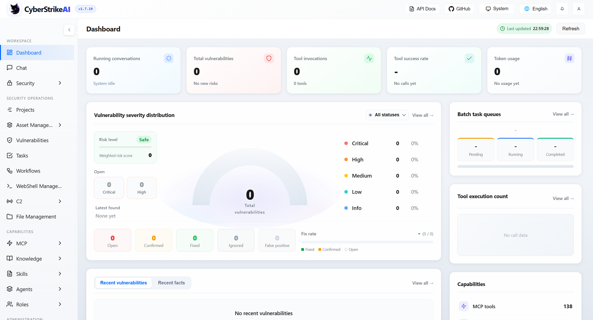

# 2. Cài đặt và Cấu hình

## 2.1 Yêu cầu

| Thành phần | Yêu cầu |
|---|---|
| **Docker** | 20.10+ (khuyến nghị) |
| **Docker Compose** | v2+ |
| **Hoặc** | Go 1.21+ + Python 3.10+ (development) |
| **AI provider** | API key từ OpenAI/DeepSeek/Qwen/Claude/Viettel Netmind |
| **Security tools** (optional) | nmap, sqlmap, nuclei, gobuster... |

---

## 2.2 Clone repo

```bash
git clone https://github.com/Ed1s0nZ/CyberStrikeAI.git
cd CyberStrikeAI
```

---

## 2.3 Cài đặt với Docker (Khuyến nghị)

### Bước 1: Kiểm tra Docker

```bash
docker --version
docker compose version
```

### Bước 2: Chuẩn bị config

Tạo file `config.yaml` từ template:

```bash
cp config.example.yaml config.yaml
```

**Cấu hình AI model** — xem [mục 2.6](#26-cấu-hình-ai-model).

### Bước 3: Chạy container

```bash
# Set password (optional - mặc định: admin123)
export CYBERSTRIKE_ADMIN_PASSWORD=admin123

# Build và start
docker compose up -d --build

# Kiểm tra status
docker compose ps

# Xem log
docker compose logs -f
```


---

## 2.4 Cài đặt với run.sh (Development)

```bash
# Cài dependencies
go mod download
python3 -m venv venv
source venv/bin/activate
pip install -r requirements.txt

# Set password (optional)
export CYBERSTRIKE_ADMIN_PASSWORD=admin123

# Chạy
chmod +x run.sh
./run.sh
```

Server sẽ khởi động trên **port 7123** (HTTPS) và **port 7134** (MCP).

---

## 2.5 Truy cập Web UI

- Mở trình duyệt: **`https://localhost:7123/`**
- Chấp nhận cảnh báo chứng chỉ tự-signed (nếu có).
- Đăng nhập:
  - Username: `admin`
  - Password: `admin123` (hoặc giá trị bạn set qua `CYBERSTRIKE_ADMIN_PASSWORD`)



---

## 2.6 Cấu hình AI Model

**Quan trọng:** Web UI chỉ hiển thị danh sách AI channels (read-only). Phải chỉnh sửa `config.yaml` trực tiếp để thêm/sửa/xóa channel.

### Thêm/sửa AI channel

1. Mở `config.yaml`
2. Thêm/sửa section `ai.channels`:

```yaml
ai:
  default_channel: netmind
  channels:
    netmind:
      name: Viettel MiniMax M3
      provider: openai_compatible
      base_url: https://stream-netmind.viettel.vn/aigw/ai/v1
      api_key: <sk-your-key>
      model: MiniMax/MiniMax-M3
      max_total_tokens: 120000
      max_completion_tokens: 16384
```

3. Restart server:

```bash
# Docker
docker compose restart

# Hoặc run.sh
Ctrl+C && ./run.sh
```

---

## 2.7 Cấu hình Optional (MCP & HITL)

### MCP (Model Context Protocol)

Bật MCP để kết nối công cụ bên ngoài:

```yaml
mcp:
  enabled: true
  port: 7134
```

Cấu hình external MCP servers:

```yaml
external_mcp:
  servers:
    my-server:
      transport: http
      url: https://mcp-server.example.com/mcp
      description: "Mô tả server"
```

### Human-in-the-Loop (HITL)

Yêu cầu phê duyệt trước khi thực thi công cụ nhạy cảm:

```yaml
hitl:
  default_mode: approval  # off | approval | review_edit
  default_reviewer: human
  tool_whitelist: [read_file, ls, glob, grep]
```


---

**Tiếp theo:** [3. Quy trình Sử dụng →](03-basic-usage.md)
