# CyberStrikeAI User Guide (Hướng dẫn sử dụng)

> **Phiên bản:** 2026-09-21
> **Mục tiêu:** Tài liệu hướng dẫn người dùng mới làm quen với CyberStrikeAI — từ cài đặt, cấu hình, đến sử dụng các tính năng chính.
> **Lưu ý:** Tài liệu này tập trung vào quy trình pentest an toàn, có kiểm soát. Không đề cập sâu C2/WebShell.

---

## 📚 Mục lục

- [1. Tổng quan](#1-tổng-quan)
- [2. Cài đặt và Cấu hình](#2-cài-đặt-và-cấu-hình)
- [3. Quy trình Sử dụng](#3-quy-trình-sử-dụng)
- [4. Kết quả & Tính năng Nâng cao](#4-kết-quả--tính-năng-nâng-cao)
- [5. Troubleshooting](#5-troubleshooting)

---

# 1. Tổng quan

## 1.1 CyberStrikeAI là gì?

CyberStrikeAI là **nền tảng pentest tự động hóa AI-native** — kết hợp lập kế hoạch, thực thi, giám sát con người, bằng chứng (evidence), và phân tích trong một workspace có kiểm soát. Hệ thống được xây dựng bằng Go, sử dụng các agent AI để thực hiện các tác vụ bảo mật (reconnaissance, vulnerability analysis, exploitation guidance, reporting).

**Đặc điểm chính:**
- **Agent-based execution**: AI phân tích yêu cầu, lập kế hoạch, gọi công cụ (tools), và tổng hợp kết quả.
- **Human-in-the-loop (HITL)**: Hỗ trợ phê duyệt trước khi thực thi các công cụ nhạy cảm.
- **Evidence-based**: Mọi kết quả được lưu trữ và liên kết (fact board, assets, vulnerabilities).
- **Modular & extensible**: Hỗ trợ MCP (Model Context Protocol), skills, roles, workflows.
- **RBAC**: Quản lý người dùng, vai trò, và phân quyền chi tiết.

---

## 1.2 Các chức năng chính

| Chức năng | Mô tả |
|---|---|
| **Chat / Agent** | Giao tiếp với AI, yêu cầu thực hiện tác vụ (scan, phân tích, tìm kiếm thông tin). |
| **Project & Attack Chain** | Tổ chức engagement theo dự án, liên kết các sự kiện thành chuỗi tấn công. |
| **Asset Management** | Quản lý tài sản (host, domain, IP, service), import/export, tìm kiếm qua FOFA/ZoomEye/Shodan. |
| **Vulnerability Management** | Theo dõi lỗ hổng, phân loại mức độ, liên kết với asset/project. |
| **Task Management** | Tạo batch tasks (nhiều tác vụ hàng loạt), theo dõi tiến độ. |
| **MCP Integration** | Kết nối công cụ bên ngoài qua Model Context Protocol (HTTP/stdio/SSE). |
| **Knowledge Base** | Lưu trữ tri thức (tài liệu, CVE, best practices) để AI truy xuất khi cần. |
| **Skills & Roles** | Skills = gói kỹ năng (SKILL.md + script); Roles = persona (prompt + công cụ). |
| **Audit & Monitor** | Ghi log thao tác, theo dõi tool execution, cảnh báo. |


---

## 1.3 Phạm vi tài liệu

Tài liệu này hướng dẫn:
- ✅ Cài đặt và khởi chạy (local, Docker).
- ✅ Cấu hình cơ bản (AI, tools, MCP, HITL).
- ✅ Quy trình sử dụng từ tạo project đến quản lý kết quả.
- ✅ Troubleshooting các lỗi thường gặp.

**Không đề cập sâu:**
- ❌ C2 (Command & Control) — xem `docs/en-US/c2.md`.
- ❌ WebShell management — xem `docs/en-US/webshell.md`.
- ❌ Plugin development (Burp Suite, browser extension) — xem `docs/en-US/plugin-development.md`.

---

---

# 2. Cài đặt và Cấu hình

## 2.1 Yêu cầu

| Thành phần | Yêu cầu |
|---|---|
| **Docker** | 20.10+ (khuyến nghị) |
| **Docker Compose** | v2+ |
| **Hoặc** | Go 1.21+ + Python 3.10+ (development) |
| **AI provider** | API key từ OpenAI/DeepSeek/Qwen/Claude/Viettel Netmind |
| **Security tools** (optional) | nmap, sqlmap, nuclei, gobuster... |

---

## 2.2 Clone repo

```bash
git clone https://github.com/Akapi895/RedForge.git
cd CyberStrikeAI
```

---

## 2.3 Cài đặt với Docker (Khuyến nghị)

### Bước 1: Kiểm tra Docker

```bash
docker --version
docker compose version
```

### Bước 2: Chuẩn bị config

Tạo file `config.yaml` từ template:

```bash
cp config.example.yaml config.yaml
```

**Cấu hình AI model** — xem [mục 2.6](#26-cấu-hình-ai-model).

### Bước 3: Chạy container

```bash
# Set password (optional - mặc định: admin123)
export CYBERSTRIKE_ADMIN_PASSWORD=admin123

# Build và start
docker compose up -d --build

# Kiểm tra status
docker compose ps

# Xem log
docker compose logs -f
```

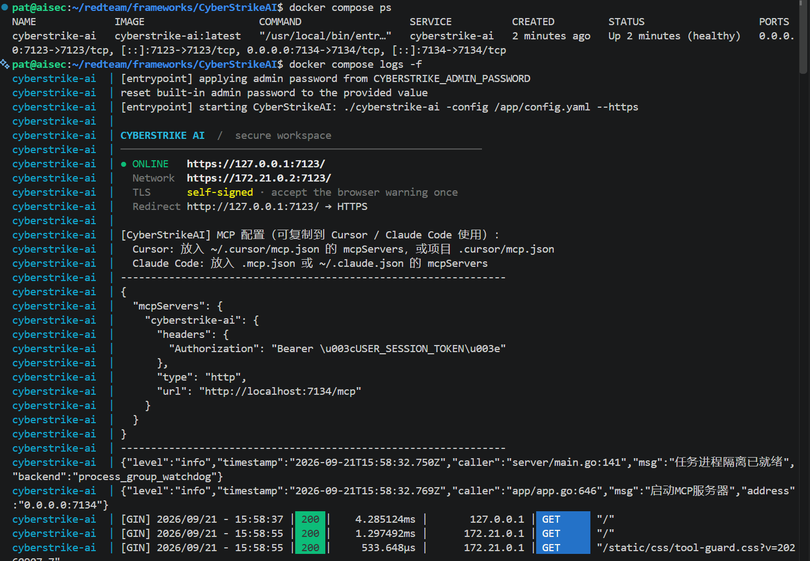

---

## 2.4 Cài đặt với run.sh (Development)

```bash
# Cài dependencies
go mod download
python3 -m venv venv
source venv/bin/activate
pip install -r requirements.txt

# Set password (optional)
export CYBERSTRIKE_ADMIN_PASSWORD=admin123

# Chạy
chmod +x run.sh
./run.sh
```

Server sẽ khởi động trên **port 7123** (HTTPS) và **port 7134** (MCP).

---

## 2.5 Truy cập Web UI

- Mở trình duyệt: **`https://localhost:7123/`**
- Chấp nhận cảnh báo chứng chỉ tự-signed (nếu có).
- Đăng nhập:
  - Username: `admin`
  - Password: `admin123` (hoặc giá trị bạn set qua `CYBERSTRIKE_ADMIN_PASSWORD`)

---

## 2.6 Cấu hình AI Model

**Quan trọng:** Web UI chỉ hiển thị danh sách AI channels (read-only). Phải chỉnh sửa `config.yaml` trực tiếp để thêm/sửa/xóa channel.

### Thêm/sửa AI channel

1. Mở `config.yaml`
2. Thêm/sửa section `ai.channels`:

```yaml
ai:
  default_channel: netmind
  channels:
    netmind:
      name: Viettel MiniMax M3
      provider: openai_compatible
      base_url: https://stream-netmind.viettel.vn/aigw/ai/v1
      api_key: <sk-your-key>
      model: MiniMax/MiniMax-M3
      max_total_tokens: 120000
      max_completion_tokens: 16384
```

3. Restart server:

```bash
# Docker
docker compose restart

# Hoặc run.sh
Ctrl+C && ./run.sh
```

---

## 2.7 Cấu hình Optional (MCP & HITL)

### MCP (Model Context Protocol)

Bật MCP để kết nối công cụ bên ngoài:

```yaml
mcp:
  enabled: true
  port: 7134
```

Cấu hình external MCP servers:

```yaml
external_mcp:
  servers:
    my-server:
      transport: http
      url: https://mcp-server.example.com/mcp
      description: "Mô tả server"
```

### Human-in-the-Loop (HITL)

Yêu cầu phê duyệt trước khi thực thi công cụ nhạy cảm:

```yaml
hitl:
  default_mode: approval  # off | approval | review_edit
  default_reviewer: human
  tool_whitelist: [read_file, ls, glob, grep]
```

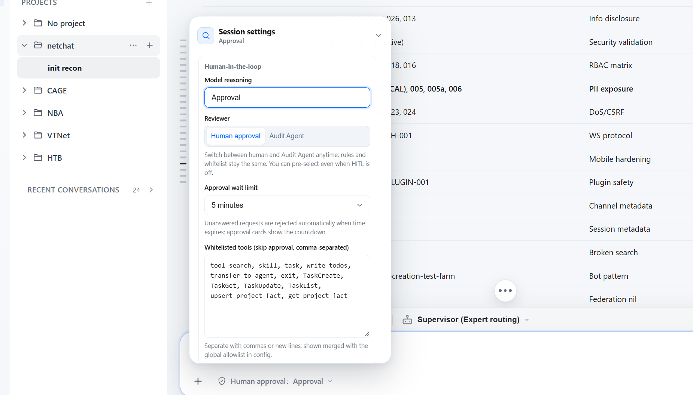

---

---

# 3. Quy trình Sử dụng

## Quy trình hoàn chỉnh

### Bước 1: Tạo Project

1. Vào **Projects** → Click **New Project**.
2. Điền:
   - **Name**: Tên project.
   - **Description**: Mô tả engagement.
   - **Scope** (optional): JSON mô tả phạm vi (target, constraints).
3. Click **Create**.

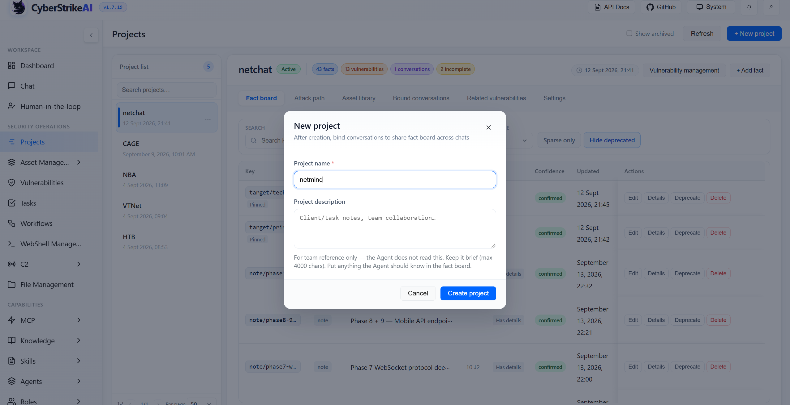

Project là container để gom nhiều conversation, fact, asset, vulnerability liên quan đến cùng một engagement.

---

### Bước 2: Mở Chat

1. Vào **Chat**.
2. Click **New Conversation** hoặc chọn project từ dropdown.
3. Nhập yêu cầu trong composer (khung nhập).

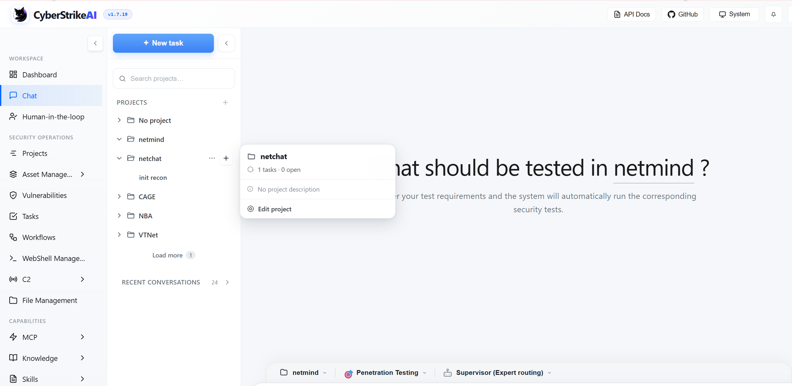

---

### Bước 3: Chọn Role

1. Click **Role selector** (dropdown hoặc side panel).
2. Chọn role phù hợp (ví dụ: `Penetration Testing`, `API Security Assessment`, `Controlled Validation`).
3. Role định nghĩa:
   - **Persona** (system prompt).
   - **Tool scope** (công cụ được phép dùng).

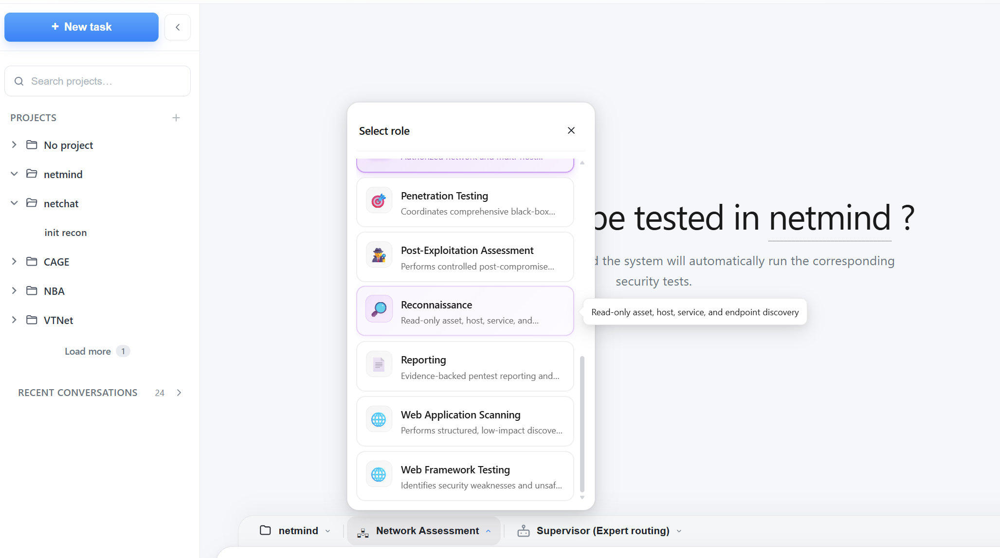
---

### Bước 4: Chọn Agent Mode

1. Click **Agent mode selector**.
2. Chọn mode:
   - **eino_single**: Single agent (đơn giản).
   - **deep**: DeepAgent mode cho các task phức tạp.
   - **plan_execute**: Planner → Executor → Replanner loop.
   - **supervisor**: Supervisor điều phối sub-agents.

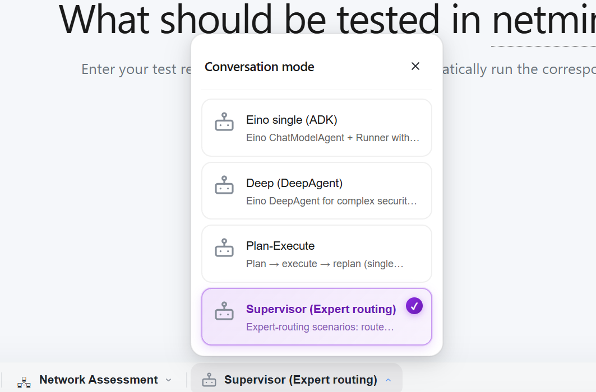

---

### Bước 5: Gửi Task

Nhập yêu cầu trong composer, ví dụ:

```
Scan open ports on 192.168.1.1
Check if https://example.com/page?id=1 is vulnerable to SQL injection
Enumerate subdomains for example.com, then run nuclei against the results
```

Click **Send** (hoặc Enter).

---

### Bước 6: Theo dõi và Review Kết quả

- **Timeline** hiển thị:
  - Tool calls (công cụ được gọi).
  - Tool results (kết quả).
  - Execution trace / Agent steps (các bước thực thi).
  - Iterations (vòng lặp).
- **Progress indicator**:
  - Đang chạy: hiển thị thời gian elapsed.
  - Đợi phê duyệt (HITL): hiển thị countdown.
  - Hoàn thành: hiển thị summary.
- **Stop task**: Click nút **Stop** để hủy tác vụ đang chạy.

---

---

# 4. Kết quả & Tính năng Nâng cao

## 4.1 Quản lý Kết quả

| Tab | Mục đích |
|---|---|
| **Facts** | Tri thức được trích xuất từ chat (target, finding, chain). Liên kết với vulnerability. |
| **Assets** | Tài sản (host, domain, IP, service). Filter theo status, project, risk level. Import/export CSV/XLSX. |
| **Vulnerabilities** | Lỗ hổng phát hiện. Filter theo severity (critical/high/medium/low/info), status (open/confirmed/fixed/false_positive/ignored). |
| **Tasks** | Tác vụ agent đang chạy hoặc đã hoàn thành. Xem timeline, result, error. |

### Facts

Facts là đơn vị tri thức (knowledge unit) trong project blackboard.

- **Key**: Mã định danh (ví dụ: `finding:subdomain`).
- **Category**: target, finding, exploit, auth, infra, chain, poc, business, note.
- **Confidence**: tentative / confirmed / deprecated.

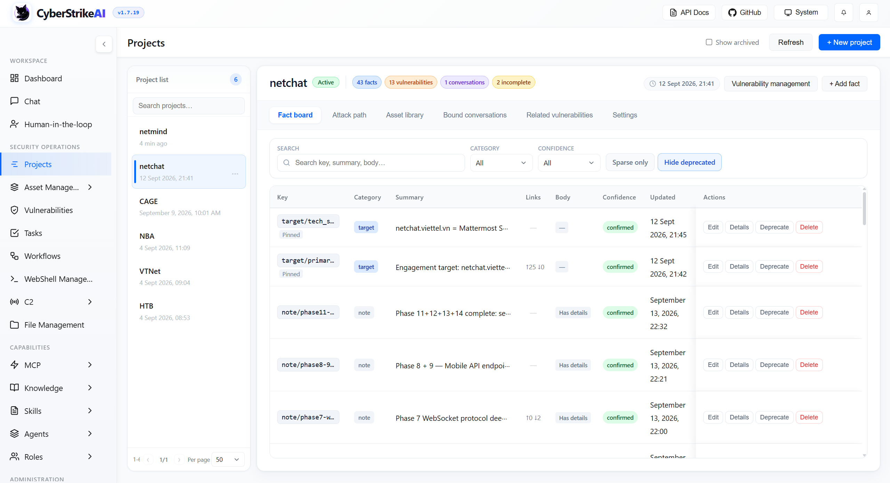

### Assets

Quản lý tài sản phát hiện:

- Filter theo: status (new/active/deprecated), project, risk level, scan state.
- Batch actions: gán project, bulk edit, merge duplicates, export.
- Import: Drag-drop CSV/XLSX.

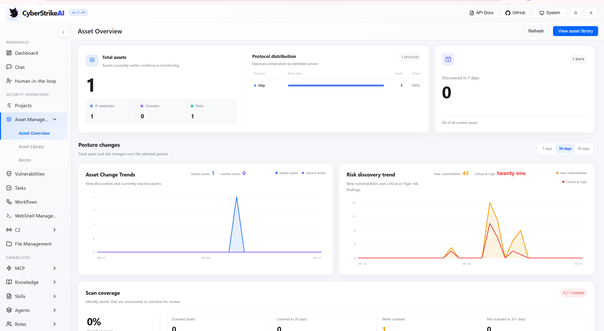

### Vulnerabilities

Theo dõi lỗ hổng:

- Card hiển thị: title, severity, status, description, reproduction steps, evidence, impact, recommendation.
- Tạo từ fact: **Link to existing vulnerability** hoặc **Create vulnerability from fact**.
- Export: Markdown (.md cho từng vulnerability).

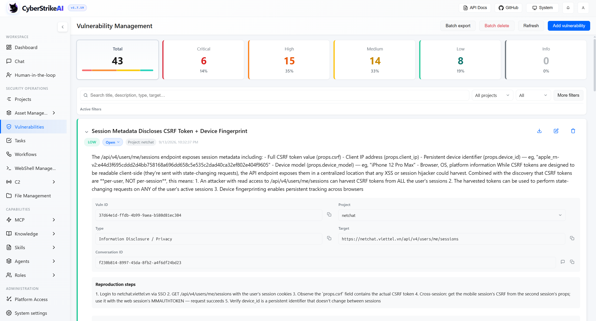

### Tasks

Xem và theo dõi tác vụ:

- Filter: status (running/completed/failed/cancelled), time (last 15m/1h/24h/7d).
- Detail: ID, session, type, command, timeline, result.

---

## 4.2 Tính năng Nâng cao

### Workflows

Workflow là đồ thị các node (start, tool, agent, condition, hitl, output, end) để tự động hóa tác vụ phức tạp.

- Kéo-thả node, kết nối, cấu hình properties.
- **AI generate**: Nhập mô tả tự nhiên → System tạo draft graph.
- **Dry-run**: Chạy thử, xem trace.
- Export/Import: File `.csapkg.zip`.

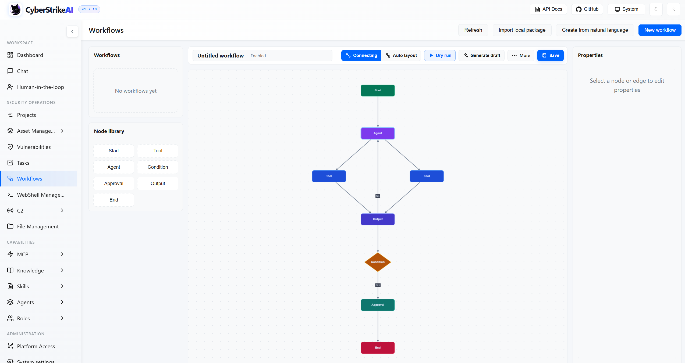

### MCP (Model Context Protocol)

Theo dõi và quản lý MCP servers đã cấu hình:

- **MCP Monitor**: Xem tool execution real-time, terminate/cancel.
- **MCP Management**: Thêm/xóa external servers, test connection.
- Tool MCP xuất hiện tự động trong Chat khi server kết nối thành công.

### Knowledge Base

Kho tri thức (tài liệu, CVE, best practices) để AI truy xuất khi cần (RAG).

- Thêm item: Category, title, content (markdown/text).
- **Scan** → Phát hiện item mới.
- **Build Index** → Tạo vector embeddings.
- AI tự động retrieval khi cần. Xem **Retrieval Logs** để theo dõi.

### Skills

Skill là gói kỹ năng (SKILL.md + script/file) cho agent.

- Xem: **Skills Monitor** (thống kê calls) hoặc **Management** (CRUD).
- Tạo: Name (lowercase, hyphenated), description, content (SKILL.md).
- Load trong Chat: Dùng tool `skill` → Chọn skill → Load.

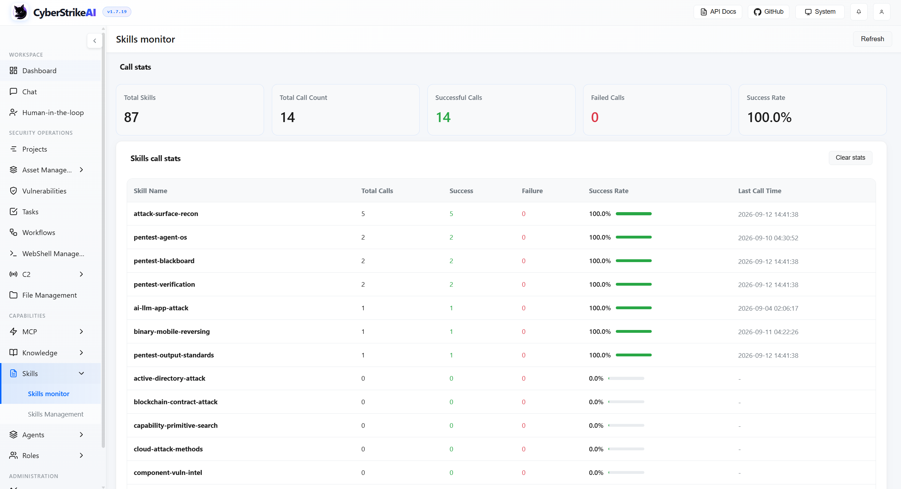

### Agents

Agents là sub-agents (multi-agent) định nghĩa bằng file Markdown trong `agents/`.

- **Orchestrator**: Agent chủ, điều phối.
- **Sub**: Agent con, thực thi tác vụ cụ thể.
- Cấu hình: tools, max iterations, instruction (system prompt).

### Roles

Role là persona (prompt + tool scope) cho agent.

- Chọn trong Chat → Tool list tự cập nhật.
- Tạo: Name, icon (emoji), description, user prompt, tools.
- Enable/disable role.

---

## Lưu ý

**C2 (Command & Control)** và **WebShell Management** là tính năng out-of-scope trong tài liệu này — xem `docs/en-US/c2.md` và `docs/en-US/webshell.md` để biết chi tiết.

---

---

# 5. Troubleshooting

## 5.1 Server không khởi động được

**Triệu chứng:** Lỗi khi chạy `./cyberstrike-ai` hoặc `./run.sh`.

| Lỗi | Nguyên nhân | Xử lý |
|---|---|---|
| `Failed to load config` | `config.yaml` không tồn tại hoặc lỗi YAML. | Kiểm tra file tồn tại. Validate: `python3 -c "import yaml; yaml.safe_load(open('config.yaml'))"` |
| `Failed to open database` | `data/` không ghi được hoặc DB corrupt. | Kiểm tra quyền ghi `data/`. Backup & xóa `data/conversations.db` để reset. |
| `port already in use` | Port 7123/7134 đã bị chiếm. | Đổi port trong `config.yaml` (`server.port`, `mcp.port`). |

---

## 5.2 Lỗi Model/API

**Triệu chứng:** Chat không trả lời, log: `API error`, `401 Unauthorized`.

| Lỗi | Nguyên nhân | Xử lý |
|---|---|---|
| `401 Unauthorized` | API key sai/thiếu. | Kiểm tra `ai.channels.<id>.api_key` trong `config.yaml`. |
| `404 Not Found` | Base URL sai. | Kiểm tra `base_url` (phải có `/v1` path cho OpenAI-compatible). |
| `Rate limit` | Vượt quota API. | Chờ hoặc nâng gói API. |
| `Model not found` | Model name sai. | Kiểm tra model name (vd `MiniMax/MiniMax-M3`, `gpt-4o`). |

**Test kết nối:**
- Vào **System Settings → AI Channel Configuration** → Click **Test connection**.

---

## 5.3 Tool không tìm thấy

**Triệu chứng:** Agent báo `Tool not found` hoặc tool không xuất hiện trong danh sách.

| Lỗi | Nguyên nhân | Xử lý |
|---|---|---|
| Tool chưa cài | Công cụ chưa có trong PATH. | Cài tool: `sudo apt install nmap sqlmap gobuster`. |
| Tool YAML lỗi | File `.yaml` trong `tools/` có lỗi cú pháp. | Kiểm tra YAML syntax. Restart server để reload. |
| Role không có tool | Role bị giới hạn tool scope. | Edit role → Thêm tool vào danh sách. |

---

## 5.4 MCP connection failed

**Triệu chứng:** MCP server không start, tool không hiển thị.

| Lỗi | Nguyên nhân | Xử lý |
|---|---|---|
| `mcp.enabled: false` | MCP chưa bật trong config. | Set `mcp.enabled: true` trong `config.yaml`. |
| Port conflict | Port 7134 đã dùng. | Đổi `mcp.port` trong config. |
| External MCP không kết nối | URL/command sai. | Kiểm tra `external_mcp.servers`. Click **Test connection** trong MCP Management. |

**Xem log MCP:**
- Vào **MCP Monitor** → Xem tool execution logs.

---

## 5.5 Agent/HITL bị stuck

**Triệu chứng:** Chat không phản hồi, agent dừng giữa chừng, hoặc task đợi phê duyệt.

| Lỗi | Nguyên nhân | Xử lý |
|---|---|---|
| `max_iterations` reached | Agent lặp quá nhiều vòng. | Tăng `agent.max_iterations` trong config hoặc kiểm tra prompt. |
| Tool timeout | Tool chạy quá lâu. | Tăng `agent.tool_timeout_minutes` trong config. |
| HITL pending | Đợi phê duyệt. | Vào **Human-in-the-loop** → Approve/Reject. |
| Model error | Model trả về sai định dạng. | Kiểm tra model response trong log. Đổi model/channel. |

**Xem chi tiết:**
- **MCP Monitor** → Tool execution detail.
- **Audit Logs** → Xem thao tác người dùng.
- Terminal log → Xem error message.

---

## Hỗ trợ

Nếu gặp vấn đề không được giải quyết trong tài liệu này:

1. **Kiểm tra logs:**
   - Terminal: xem log khi chạy server.
   - **System Settings → Audit Logs** → Xem thao tác.
   - **MCP Monitor** → Xem tool execution.

2. **Tìm kiếm trong docs:**
   - `docs/en-US/troubleshooting.md` — Troubleshooting chi tiết.
   - `docs/en-US/configuration.md` — Configuration reference.

3. **Community:**
   - GitHub Issues: https://github.com/Ed1s0nZ/CyberStrikeAI/issues

---

**End of User Guide**
